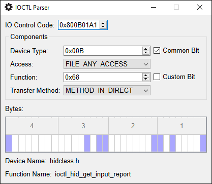

# IOCTL Parser

A simple tool for parsing and identifying IO control (IOCTL) values and their subcomponents.
The structure of an IOCTL value is documented on MSDN.1

Name identification for devices and functions are supported by using an embedded offline copy of the values on the "Windows IOCTL Reference" website.2
The tool can support identifying additional device and function names by passing configuration files as arguments.
If you are interested in doing this, please use the structure of the [provided example file](example.ini) or the [embedded configuration file](resources/IOCTLs.ini) as a reference.

## References

1. [Defining I/O Control Codes](https://docs.microsoft.com/en-us/windows-hardware/drivers/kernel/defining-i-o-control-codes)
2. [Windows IOCTL Reference](http://www.ioctls.net/)